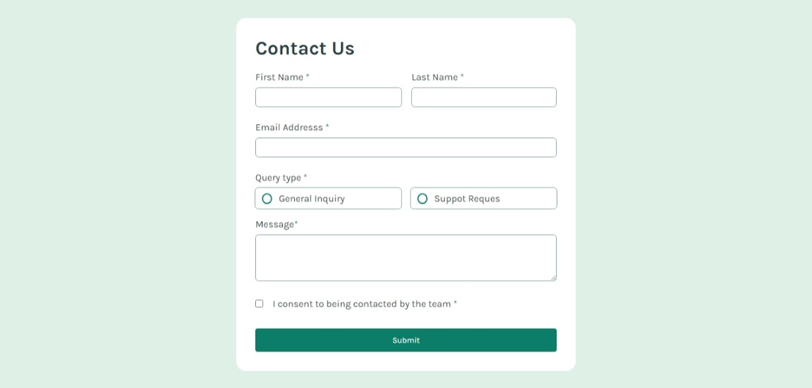

# Frontend Mentor - Contact form solution

This is a solution to the [Contact form challenge on Frontend Mentor](https://www.frontendmentor.io/challenges/contact-form--G-hYlqKJj). Frontend Mentor challenges help you improve your coding skills by building realistic projects. 

## Table of contents

  - [Overview](#overview)
  - [The challenge](#the-challenge)
  - [Screenshot](#screenshot)
  - [Links](#links)

### The challenge

This challemge makes me think so hard, as a beginner im having a hard time to understand what is the right code to be use especially in JavaScrip.

### Screenshot

### Links

- Solution URL: [(https://www.frontendmentor.io/solutions/contact-form-challenge-sogtCEKhqs)]
- Live Site URL: [(https://otep02.github.io/Contact_Form/)]

### Built with

- Semantic HTML5 markup
- CSS custom properties
- Flexbox
- CSS Grid
- JS

